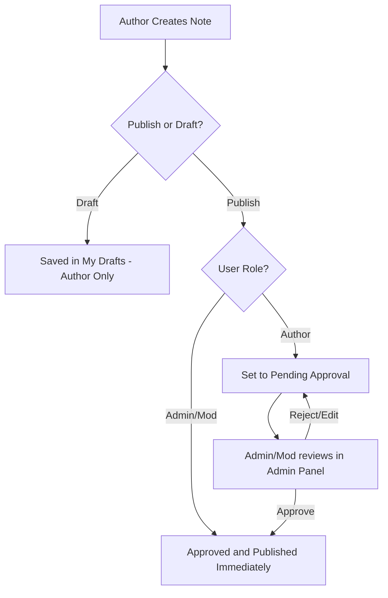

# Standard Operating Procedure (SOP): SysNotes Management & Operations

This document establishes the guidelines, roles, and workflows for using and operating the **SysNotes** knowledgebase application.

---

## 1. Team Directory & Roles

The system uses three default teams for isolation and permission management:

1. **Sysadmin**: For global infrastructure, network policies, hardware maintenance, and hypervisor management notes.
2. **OS Admin**: For operating system specific tasks, kernel updates, service configurations (Systemd/SysV), package management, and shell utilities.
3. **App Admin**: For application runtime configurations (Flask, Nginx, Docker, databases), build pipelines, and application-level troubleshooting.

### Access Levels:
* **Admin**: Complete system visibility. Can manage users, edit teams, flush the server cache, monitor system status, and view raw audit logs.
* **Moderator**: Can edit categories, view tags, and immediately approve pending note changes.
* **Author**: Can create/edit drafts. Note changes must be approved by an Admin or Moderator before publication.

---

## 2. Note Visibility & Security Rules

To ensure that confidential systems remain isolated, note visibility must follow these guidelines:

* **Global Notes**: Notes set to `Global` visibility are public. Unauthenticated users (visitors) and members of any team can view them. **Do not put credential information or server IPs in Global notes.**
* **Team-Restricted Notes**: Notes assigned to a team (e.g., `OS Admin`) are visible **only** to authenticated members of that team (and Admins). Unauthenticated visitors will receive a `403 Access Denied` error if they try to access the note link.

---

## 3. Workflow for Creating and Approving Notes



1. **Creating a Note**: 
   - Choose **Command** type for single-line terminal scripts.
   - Choose **Procedure** type for step-by-step guides with checkbox progress lists.
2. **Revisions**: The system automatically captures a history revision whenever a note is updated manually, allowing rolling back to previous states via the note's history panel.

---

## 4. System Maintenance (Admin Only)

Admins can monitor system wellness using the **Admin Panel**:

### Server Metrics Gauges
* **Green (< 60%)**: Safe operating range.
* **Yellow/Orange (60% - 85%)**: Elevated load, monitor activity.
* **Red (> 85%)**: Threshold exceeded. Investigate active processes or memory leaks.

### Caching Operations
* Read-heavy queries (categories, tags, settings) are cached in memory with a Time-to-Live (TTL) expiration.
* If updates are not showing up immediately, click **Flush Server Cache** in the Cache Operations card.

### Database Backups
* SQLite databases are automatically backed up to the `backups/` directory.
* Auto-backups can be configured under the **Backup** settings tab.

---

## 5. Local SSL Setup for Developers

For secure HTTPS traffic on `localhost`:
1. Open a terminal in the project root.
2. Activate your virtual environment: `venv\Scripts\activate`
3. Execute the SSL helper:
   ```bash
   python generate_ssl.py
   ```
4. This script automatically creates `key.pem` and `cert.pem` using the Python `cryptography` library (or falls back to the native `openssl` CLI). These are automatically ignored by git.
